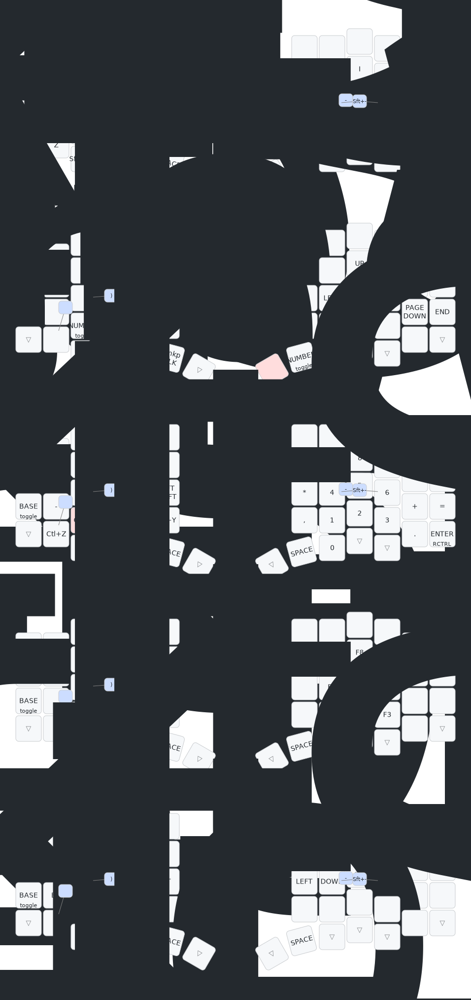

# Anywhy Flake Firmware

> **Important**: If you have a board version prior to 1.0, you should use the config from Flake_v0.1/v0.2 [branch](https://github.com/anywhy-io/flake-zmk-module/tree/Flake_v0.1/v0.2) and [actions](https://github.com/anywhy-io/flake-zmk-module/actions?query=branch%3AFlake_v0.1%2Fv0.2).

You can tap the "Actions" tab, and download the newest firmware. Unzip it.

Connecting to your keyboard. Click two times of the reset button on the back of the keyboard. 

The .uf2 file with lable "left" is for the left hand keyboard, and the lable "right" is for the right hand keyboard. Just drag the file to the document. Once the document dispear, the firmware is done.

## Flake keymap

This photo is the full vision of Flake-L(58 keys). However, if your keyboard is M or S, you can also refer to this keymap, just ignoring the additional keys.

